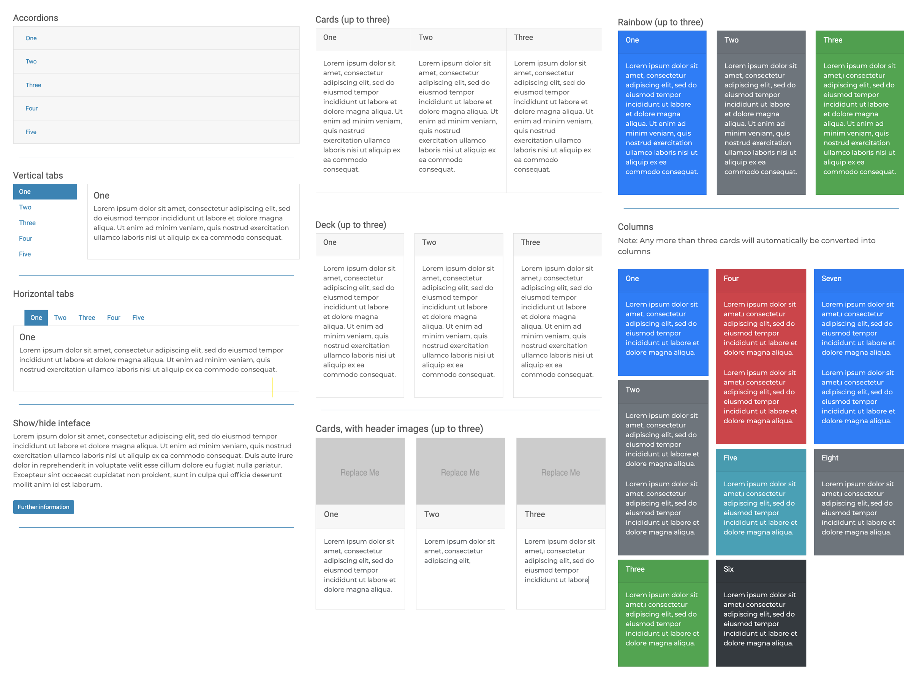

# Sublime-BuildBootstrap

## Build Bootstrap interface elements for Sublime Text

This SublimeText plugin allows you to rapidly develop Bootstrap interface elements, including:

* Accordions
* Tabs - both vertical and horizontal
* Show/hide
* Various card layouts and colours - Card groups, Card decks (with and without card images), rainbow cards and columns

### Note

* Each UI element is given a unique ID to avoid one element accidentally controlling another (eg. if you have two accordions on the one page)
* for card based interfaces, any more than three cards will automatically default to column view

## Video tutorial

[Build Bootstrap interface elements for Sublime Text (08:12)](https://www.youtube.com/embed/Z8MGYE1QJCc?rel=0)

## Installation

### Download Manually (only option available currently, sorry)

* Download the files using the [GitHub 'Download Zip' option](https://github.com/BirdyOz/Sublime-BuildBanner/archive/refs/heads/master.zip)
* Unzip the files and rename the folder to `BuildBootstrap`
* Find your `Packages` directory using the ST menu item  `Preferences -> Browse Packages...`
* Copy the folder into your Sublime Text `Packages` directory

## Dependancies

This plugin invokes functions from other Sublime Text Packages:

<ul>
    <li><a href="https://packagecontrol.io/packages/HTML-CSS-JS%20Prettify" target="_blank">HTML-CSS-JS Prettify - Packages - Package Control</a></li>
</ul>

Please ensure that you have this plugin installed, **prior to running BuildBootstrap**

## Usage

1. Launch Package Control
2. Type 'Build Bootstrap'
3. Choose Bootstrap interface element

## Keyboard shortcuts (Mac) - Sorry Windows users, feel free to set your own.

Thes use a chain of two commands, in quick succession, eg: for For **B**uild **A**ccordion:

1. Hold down the three keys <kbd>⌃</kbd> + <kbd>⌥</kbd> + <kbd>⌘</kbd> - and keep them held down
2. Press <kbd>B</kbd>, then <kbd>A</kbd> in quick succession

### Shortcuts

* <kbd>⌃</kbd><kbd>⌥</kbd><kbd>⌘</kbd><kbd>B</kbd>, <kbd>⌃</kbd><kbd>⌥</kbd><kbd>⌘</kbd><kbd>A</kbd>  - **B**uild **A**ccordion
* <kbd>⌃</kbd><kbd>⌥</kbd><kbd>⌘</kbd><kbd>B</kbd>, <kbd>⌃</kbd><kbd>⌥</kbd><kbd>⌘</kbd><kbd>T</kbd>  - **B**uild **T**abs (Vertical)
* <kbd>⌃</kbd><kbd>⌥</kbd><kbd>⌘</kbd><kbd>B</kbd>, <kbd>⌃</kbd><kbd>⌥</kbd><kbd>⌘</kbd><kbd>H</kbd>  - **B**uild Tabs (**H**orizontal)
* <kbd>⌃</kbd><kbd>⌥</kbd><kbd>⌘</kbd><kbd>B</kbd>, <kbd>⌃</kbd><kbd>⌥</kbd><kbd>⌘</kbd><kbd>S</kbd>  - **B**uild **S**how/Hide
* <kbd>⌃</kbd><kbd>⌥</kbd><kbd>⌘</kbd><kbd>B</kbd>, <kbd>⌃</kbd><kbd>⌥</kbd><kbd>⌘</kbd><kbd>C</kbd>  - **B**uild **C**ard Group
* <kbd>⌃</kbd><kbd>⌥</kbd><kbd>⌘</kbd><kbd>B</kbd>, <kbd>⌃</kbd><kbd>⌥</kbd><kbd>⌘</kbd><kbd>D</kbd>  - **B**uild Card **D**eck
* <kbd>⌃</kbd><kbd>⌥</kbd><kbd>⌘</kbd><kbd>B</kbd>, <kbd>⌃</kbd><kbd>⌥</kbd><kbd>⌘</kbd><kbd>I</kbd>  - **B**uild Card Deck, with **I**mages
* <kbd>⌃</kbd><kbd>⌥</kbd><kbd>⌘</kbd><kbd>B</kbd>, <kbd>⌃</kbd><kbd>⌥</kbd><kbd>⌘</kbd><kbd>R</kbd>  - **B**uild **R**ainbow Cards